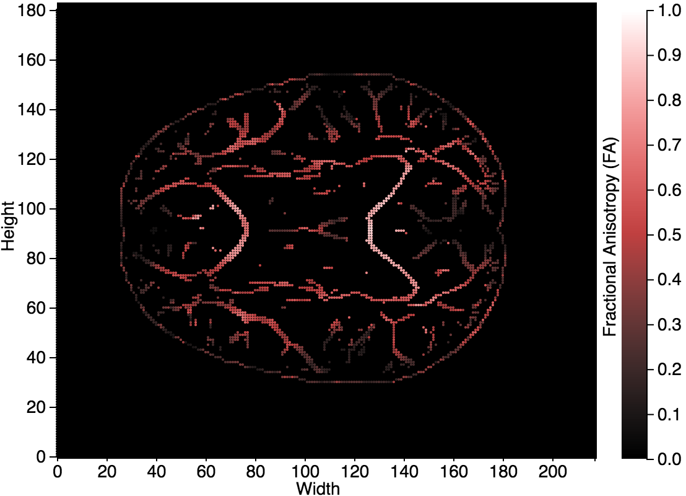
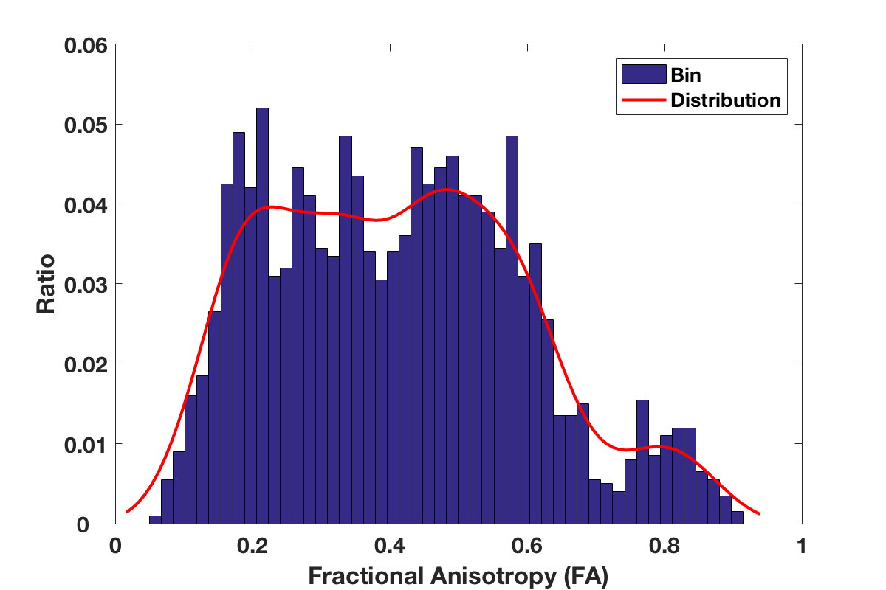

#Introduction

In this project, I try to use two tools (D3 and Matlab) to visualize one diffusion tensor imaging of a brain in a way that it can better characterize different micro-structural changes. The image is stored in `data1.txt` as a space separated matrix, where each value in the matrix represents a FA (fractional anisotropy ) value (`Data Type: ratio`) in the range of [0,1]. According to [the definition of FA on Wikipedia][1], the higher the value, the higher the fiber density, axonal diameter, or myelination in white matter. An example view of this image _provided by the course_ is shown below:

[]()

The basic image maps `0` to black and maps the FA increase as the increase of the satuation of `green`. Two properties could be observed from the figure:

1. Most area are black (`value = 0`), indicating that there is no, e.g., fiber. This area is usually not important.
2. Interesting areas (`value > 0`) are sparse distributed in the figure. Some areas are lighter in green, which means the FA is high, while other areas are darker in green, which means the fiber density there is lower.

In order to have all the important information characterized. It is not enough to have this `green` figure that highlight the high density areas (_**P0**_). Because the following problem can't be solved with the original figure:

1. **P1: Low density areas are not intuitive**. If we are more interested in low density areas in the application, there is a need to highlight the low density areas. Because it's not intuitive to our visual system to directly present them to our brain.
2. **P2: Interest areas might be in a specific range**. If the point of interest is within a range such as `value=[0.3, 0.5]`, the original figure can not help us to identify these regions.
3. **P3: FA distribution might be more interesting**. One research has pointed out that [FA distribution might serve as additional measures to help monitor desease progression for patients][2]. I believe there is a need to visualize the distribution of FA.

To solve these problems, the design and implementation is arranged as bellow based on the course requirement that two tools should have two visualization:
 * _**P0**_ and _**P1**_ are implemented by **D3**. In this visualization task, I explore to encode FA as `luminance`, `saturation`, `shape`, and `radius of circle` to implement the task _**P0**_ and _**P1**_.
 * _**P2**_ and _**P3**_ are implemented by **Matlab**.

#Visualization with D3

**Basic Design**. No matter which area, the interested parts (`value > 0`) are in high spatial frequencies from the `texture` perspective. So I encode the `FA value` using `Luminance`, which is suitable for visualizing image in high spatial frequency based on \[[3]\]. By utilizing `luminance`, we can differentiate structures from the background. Another observation is that the interesting areas are formed by connected values in stripes/lines while consecutive values are very similar. If we only use `luminance`, it's difficult to capture those variance within those lines. To capture this subtle difference within lines, we can utilize `saturation varying color`, which is very suitable for human eye to capture this subtle changes (low spatial frequency).

## High density area
In this scenario, the interesting areas are high density areas, we need to differentiate them from background and low density areas. Based on the basic design, the basic encoding is to encode high FA value to high Luminance `H=hsl(0,0,1)` while the low FA value to low Luminance `L=hsl(0,0,0)`. The result is illustrated in **Figure 1(a)**. To differentiate the subtle difference within lines, we increase the `saturation` component when FA increases so that higher FA are more apparent. We achieve this as follows:
 ```
 H'=H+(0,1,0)=(0,1,1)
 L'=L+(0,0,0)=(0,0,0)
 ```

  |  
:-------------------------:|:-------------------------:
(a) Luminance (`d3_p0.html`)             |  (b) Luminance + saturation (`d3_p1.html`)
  | 
(c) Luminance + saturation + shape (`d3_p2.html`)             | 
 **Figure 1. The visual design for characterizing high density areas (a)-(c).**

The result is shown in **Figure(b)**. However, there is still one problem, the **aliasing** of each pixel with `FA>0` is disturbing and incoherent to human eyes. To counter this problem, I encode the shape from the default `rectangle` to `circle`. The result is illustrated in **Figure(c)**. This result is more coherent. Even some small areas could be easily recognized without too much cognitive load.

## Low density area

For highlighting low density areas, the visualization process is similar but the color is reversed as below.
```
 H'=H+hsl(0,0,0)=hsl(0,0,0)
 L'=L+hsl(0,1,0)=hsl(0,1,1)
```
 |  
:-------------------------:|:-------------------------:
(a) Low density areas (`d3_p3.html`)           |  (b) Low density areas + Circle radius (`d3_p4.html`)
**Figure 2. Low density areas.**

However, the background color would be occupied by `white`(`value=0` maps to `rgb(255,255,255)` based on `hsl` color model). This will prevent us from seeing the low density areas. So I specially mapped `value=0` to `rgb(0,0,0)`. Although this color is original mapped high density area, it's feasible as high density area are as unimportant as the background. The result is presented in **Figure(d)**. We could observe the low density areas. However, the dark red color still draws our attention. To let the low density area draw more of our attention, I encode `FA value` to another dimension, `the radius of the circle`. The result is in **Figure 2(b)**. It shows when the density is lower the radius is larger. The low density area can apparently draw more attention.

#Visualization with Matlab

##Specific range
Since our purpose of this task is to characterize a specific range, such as to filter out the range `[0.3,0.5]`, we should make other areas less eye catching. To achieve this, I first try to use `circle radius` to represent the importance of the range. The mapping is as below:
  ```
  1) 0.3~0.5: the radius is set to largest.
  2) From 0.3 to 0: the radius decreases. 
  3) From 0.5 to 1: the radius decreases.
  ```
The result is is illustrated in **Figure 3(a)**. As you can see, the low and high density areas are still not filtered out,which means just adjusting the shape based on the original technique is not enough. To counter the problem while preserving the low and high FA value trend within the specific range. The color mapping should be changed so that only colors in the specific range can draw our attention. To achieve this goal. The mapping of color is as follows:
```
  1. 0.3~0.5: Varying colormap is used, 0.3->0.5 equals to green->red. This captures the low spatial frequencies.
  2. From 0.3 to 0: 0.3->0.0 equals to r^5*green+(1-r^5)*grey. So the color quickly fades but can still be distinguished from the background.
  3. From 0.5 to 1: 0.5->1.0 equals to r^10*red+(1-r^10)grey. So the color quickly fades too and can still be distinguished from the backgroun. The reason why the exponential component is higher is that if the component is the same, the importance will not decrease at the same ratio. Increasing this component would allow them to decrease nearly the same. 
```

 |  
:-------------------------:|:-------------------------:
(a) Range `[0.3,0.5]` (`matlab_range.m`)           |  (b) Range + Color remapping (`matlab_range1.m`)
**Figure 3. The visualization design process for Specific Range**.

**Figure 3(b)** shows the final result. The interested area is very easily to be distinguished from the other areas. Moreover, the small variation within the range is still very vivid.

##FA distribution

To show the FA distribution of a brain, the straightforward method is to use a histogram and then apply a fit. Matlab provides a build-in function _`histfit`_ to finish this task. **Figure 4(a)** showns a result with the configuration of `50 bins` and a `kernal` distribution estimator. 

 |  
:-------------------------:|:-------------------------:
(a) FA distribution by `histfit` (`matlab_1.m`)           |  (b) Improved Visualization by fading bins (`matlab_2.m`)
**Figure 4. The visualization design process for FA distribution.** The distribution is more visible after applying `transperency` to bins.


Since the purpose of this task is to show the distribution instead of the bins. I fade the face and line `transperency` of the bins to `0.05` to make the fitted distribution stand out while still preserving the view of original data. The improved result is illustrated in **Figure 4(b)**. The distribution is much more clear and we can still have a glimpse of the original data.

#Conclusion

In this homework, I use two tools (D3 and Matlab) to explore different design options and parameters, including `Color`, `Shape`, and `Size`. Among the figures I generated, I like **Figure 3(b)** the most because I like the color and it can very vividely show the specific range.

Between the two tools, the hand-on experience told me that I like Matlab more than d3 because the low level implementation such as the legend and scale has already been implemented. And it also provides good functionality such as fitting a distribution. The only drawback is that the code can't be rendered on webpage while d3 provides the capability.

[1]: https://en.wikipedia.org/wiki/Fractional_anisotropy  "Fractional Anisotropy on Wikipedia"
[2]: http://lmt.projectsinknowledge.com/Activity/pdfs/2023_02/952.pdf "Mean Diffusivity and Fractional Anisotropy Histograms of Patients with Multiple Sclerosis"
[3]: http://www.research.ibm.com/people/l/lloydt/color/color.HTM "Why Should Engineers and Scientists Be Worried About Color?"
