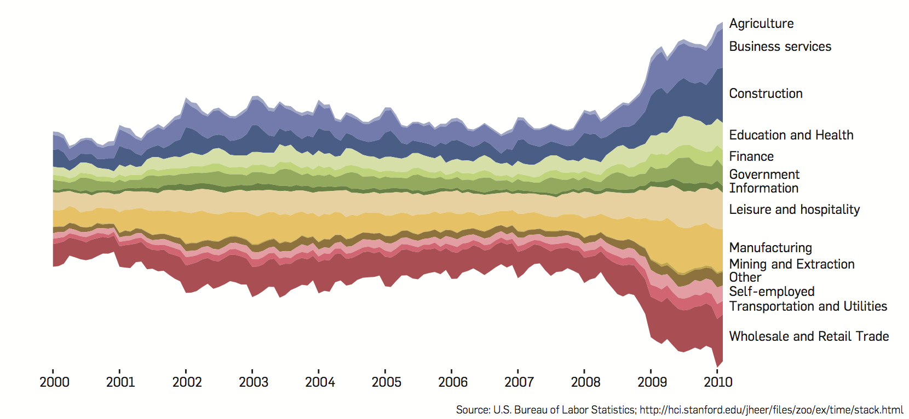

# Literature Review

In this homework, we are going to do critical analysis of two visualization examples. One is selected as an ineffective example and the other effective. 

The paper I selected from the reading list is:

* Jeffrey Heer, Michael Bostock, Vadim Ogievetsky (2010), A Tour through the Visualization Zoo, Communications of the ACM, vol. 53, no. 6, pp. 59-67, 2010.

I find both the effective visualization and ineffective visualization from this paper.

#The ineffective visualization

 

**Figure 1. Stacked graph of unemployed U.S. workers by industry, 2000–2010\[[1][1]\].**

The effectiveness is less than 13% (1/6). Because this figure can only convey the overal trend of unemployed U.S. workers while it is difficult for human eyes to distinguish the max,min overall or during a specific time. It's better to lower half be a straight line rather than changing lines to represent data.

The most noticeable elements of this visualization are 1) the overall changing bandwidth, 2) the color of each sub-band and 3) the bandwidth of each subband. And they are the most important.Although all elements carry information information, the information to show the max, min or local trend is missing. For example, the min unemployed U.S. workers are nearly impossible to be identified with the current coloring method. And the labeling is a little confusing without counting from top to bottom. It's not effective. Moreover, this color visualization encourages a misperception of the min unemployed U.S. works from `Mining and Extraction` to `Agriculture` or `Information`.

In order to make the presentation more effective, my suggestions are as below: 

1. They can `first` change the coloring method by `adding a color lengend that shows the ranking using illuminan components`. In this way, users can clearly identify the maximum unemployed and employed works in U.S.
2. They can `shift` the figure so that the lower part is on the line instead of changing. In this way, users can clear see when the overall unemployment reaches its min or max.
3. They can add a enlarge circle to the min component `Mining and  Extraction`, to indicate that it is min. Otherwise, we can't see it unless we can zoom in and in.
4. For those labels that occupies more that two sub-band, add a line from it to its sub-band.

#The effective visualization

 

**Figure 2. Cartesian node-link diagram of the Flare package hierarchy\[[1][1]\].**

This visualization is very effective from the perspective of showing the hierarchy. Because it first shows the nodes in each layer in a very compact circle area. We can easily figure out the relative depth of each node. Moreover, the number of children is well represented by the angle of connected lines from their parents. We could easily figure out the direct child of flare that contains most number of children is `query`.

The most noticeable elements of this visualization are 1) the node circle, 2) the angle formed by connections from parents to children, 3) the number of connections, and 4) the relative distance to the center of the circle.

With all the previous noticeable elements, no essential information is missing. And they carry the very amount of information. However, color could be used more effecient. We can add a coloring method to make the inner layer more standout so that their layer in the hierarchy could be more clear. Then, there will not be any misperception.

In order to improve the visualization, my only suggestion is:

1. For each layer of nodes, use a difference color instead of using just one color for the internal nodes.

#Citation

\[1\], http://queue.acm.org/detail.cfm?id=1805128  "A Tour through the Visualization Zoo"

[1]: http://queue.acm.org/detail.cfm?id=1805128  "A Tour through the Visualization Zoo"