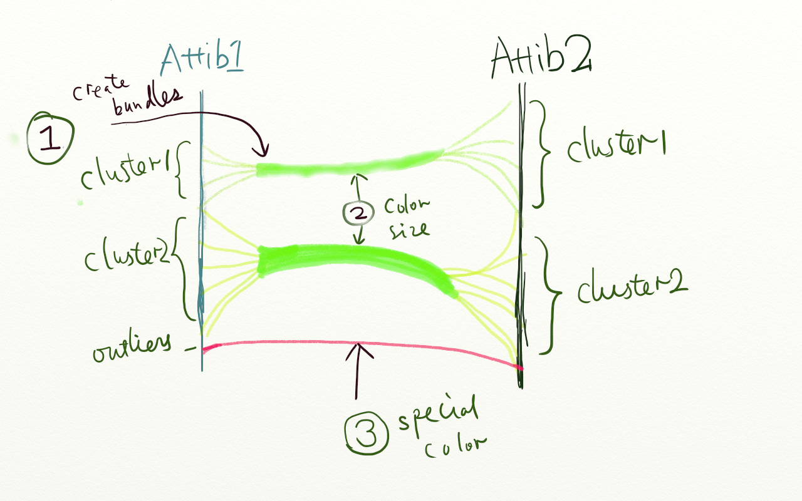
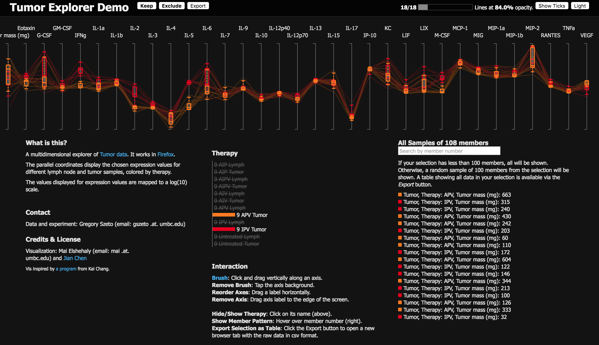

#Part I: Design Solution

## Group Information

* **Group name**: Unknown 
* **Group Idea**: 
    1. cluster values for each attributes and then create bundles between parallel coordinates.
    2. Assign colors according to the bundle size.
    3. Assign special colors to bundles that are the goal of the task.
* **Group sketch**: The group sketch according to the idea is shown in Figure 1. 

**Figure 1. The group sketch based on our group idea**

* **Pros and Cons**:
    * **Prons**: The distribution is clear and it's easy to distinguish two distributions if they are different on the same parallel coordinate
    * **Cons**: It's not every effective when the distributions of multiple data are quite similar and the size of data is very large relatively to the display.

## Design choices

* tasks and dataset attributes description
* mapping tasks and data needs in encoding process
* Design choices
* Good and Bad
* Issues, and future fixes

## Steps to produce the visualization

1. Create a boxplot alone
2. Parse the data to extract the information for plots
3. Add the code to render the plot as a function
4. Add code to toggle on/off

**Figure 2. Plot two therapies in red and brown with box-and-whisker plot.**

## Change in the future

# Part II: Implementation

* Program runs (10 points, undergraduate only)
* Computed box-and-whisker plot correctly (5 points)
* depiction is correct (20 for)
* On/off box-and-whisker when therapy is toggled (10 points)
* shifted view (10 points, graduate student only)

# Part III: Extra credits

* (20 points) Draw the relationship lines in the parallel coordinates from the edge of the box-and-whisker plot, not the center so that the box-and-whisker plot can be clearly seen.
* (20 points) Draw the distribution similar to the one below. Laying out the distributions vertically will be okay.
