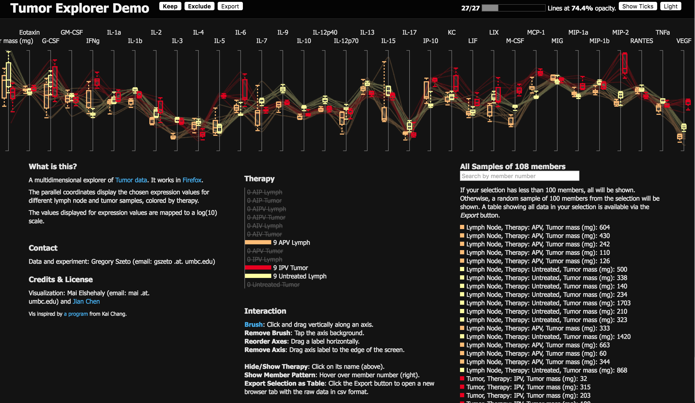

# Part I: Design Solution

## Group Information

* **Group name**: Unknown 
* **Group Idea**: 
    1. cluster values for each attributes and then create bundles between parallel coordinates.
    2. Assign colors according to the bundle size.
    3. Assign special colors to bundles that are the goal of the task.
* **Group sketch**: The group sketch according to the idea is shown in Figure 1. 

**Figure 1. The group sketch based on our group idea**

* **Pros and Cons**:
    * **Prons**: The distribution is clear and it's easy to distinguish two distributions if they are different on the same parallel coordinate
    * **Cons**: It's not every effective when the distributions of multiple data are quite similar and the size of data is very large relatively to the display.

The solution we provided is as described above. However, since in class what we all agreed on is to create the visualization using boxplot. So the following section is the design and implementation for `boxplot` visualization.

## Design choices

### Tasks description

In homework three, we can choose from three tasks to visualize the tumor data in `parellel coordinate`. The three tasks are: 

* The first task is to develop a visualization technique to visualize the distributions for each therapy on the same attribute in such a way that we can easily distinguish between two ore more therapies. 
* The second task is to group the clutters between two parallel attribute so that similar items are grouped together. 
* The last task is to develop an interaction technique to select areas of interest, which might be very strangely distributed.

Based on our discussion in class, the first task is selected.

### Dataset attributes

The tumor data set contains the therapy information for 108 samples, 12(therapy)x9(subject). Each sample contains 33 attributes. 

### mapping tasks and data needs in encoding process

In the first task, we are trying to 1) map the distribution of each therapy on each attribute to one boxplot, and 2) provide a mapping for human to visually distinguish between two or more therapies. There are three mappings in the encoding process,

1. Each therapy maps to one boxplot on each attribute.
2. Each type of therapy maps to one specific color.
3. The `5%, 25% 50% 75% and 95%` attribute value of each therapy's distribution among its 9 data values is mapped to the five configuration value of a boxplot.

### Design choices

I basically have two design choice while I try to implement the boxplot to visualize distributions.
* The first design choice is to decide how wide each boxplot should be so that we can see each clearly. Given the limited screen space, the width of the box should be small enough. So I selected three width parameters `4,8,12` to visually check which meet the requirement that it should be small enough to fit on the screen and large enough so that we can see it. With this criteria, I selected `8` as the width. I also find that it also looks very cool on `4k` screen.
* The second design choice is to decide how many boxplot should be put on each attribute side by side. Since putting all 12 boxplot side by side requires a lot of space and ususally we only have a screen around `1377*768` that is relatively small. I need a threshold to decide when to put the boxplot side by side or together on the attribute line. Since the purpose of ploting the boxplot is to differentiate the distributions between different therapies. The number of distribution on the same attribute should follow the principle of our short term memory (7+=2). So based on the size limit and the memory limit. I choce 5 as the threshold. When the number of visible therapies is less or equal to 5, I will put them side by side, otherwise they shall be put on the same attribute. After the implementation, I found that 5 is too much, since there are 5 boxplots on each attribute. This is really very dstracting. After reducing the number of distributions that should stay side by side, I found that `3` is a perfect cutoff. So, the final design for boxplot that stays side by side is `below 4`.   

### Implementation choice

* The first implementation choice is to either use boxplot codes from other authors or implement the boxplot by myself. They are many available source on the website (e.g., codes [from Mike Bostock](https://bl.ocks.org/mbostock/4061502) and [Jens Grubert](http://bl.ocks.org/jensgrubert/7789216)). Since boxplot is very simple to implement and I want one `svg:g` to contain the boxplot and the homework requires us to precisely control the location, I implemented one on my own. The experimental code is in `bw_plot.html`.
 

### Good and Bad

This design is both good and bad.

* Good. Boxplot clearly shows the ditribution. And if the number of boxplot is small. It's very easy to distinguish the distribution from each other on each attribute.
* Bad. First, when most of the boxplots need to be shown on the attribute axis, it's very difficult to distinguish them from each other's distribution, even when they stay side by side. Second, when there are many boxplots on each attribute staying side by side, the coloring of adjecent boxplot should be well designed otherwise, it's not easy to see them. For example, `AIPV Tumor` is very difficult to be recognized from `AIP Lymphy` and `IPV Lymphy` when only these three is selected to show.

### Issues, and future fixes

1. The first issue I run into is that when the web brower is resized, the boxplot is not resized accordingly. However, I have added `update_boxplot` to fix this problem.

## Steps to produce the visualization (Basic requirement)

### Basic requirement:

I followed the following five steps to get the correct output for the basic requirement

1. I first design and implement the `boxplot` in `bw_plot.html`
2. Parse the data to extract the information (i.e., the `y coordinate` for `5%`, `25%`, `50%`, `75%` and `95%`) for boxplots in the `processData` function in `boxplot.js`
3. Add the code to render the plot as a function `genPlot`, which is called within a new `g:boxAxis` for each `g.dimension`
4. To toggle on/off boxplot, I add `visibility` switch for each boxplot in the `on click` event of `legend` in `parallel.js`.
5. To fix the first issue, I added the function `update_boxplot` resize the boxplot

**Figure 2. Plot two therapies in red and brown with box-and-whisker plot.**

### Shifted view (graduate student)

Based on the implementation in the previous section, by altering the `left top x` location of each visible boxplot in `update_boxplot`, we could generate the shifted view as illustrated in **Figure 3**.

**Figure 3. Shifted view of three therapies in brown yellow and red with box-and-whisker plot.**

Based on my design choice, when the number of therapies is larger or equal to 4, all boxplots stay on the attribute. Otherwise, they will stay side by side on each attribute.

## Change in the future

In the future, I will try to do the extra credits. Because the time is really limited.

