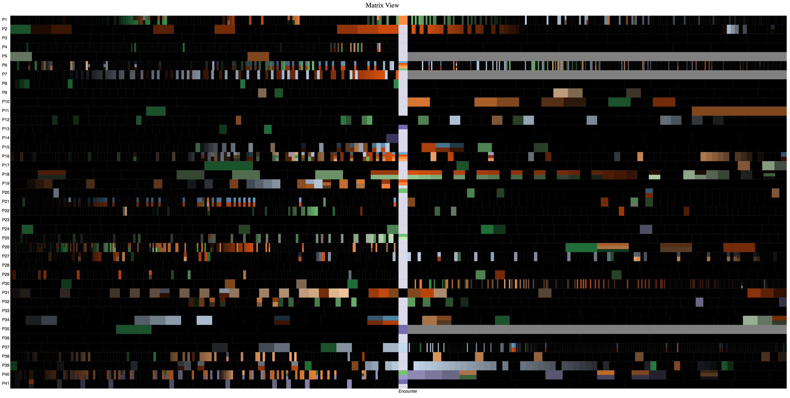

#Part I: Design Solution

## Task description

The task I want to explore in this assignment is: Does TBI change the symptom one have?

Since we are not sure what the data is, we need to give an `overview of all the symptoms before and after the TBI date` so that we can answer this question. With this overview, we may be able to identify the changes for each patient.

## Dataset Attribute description

The dataset we use is an electronic health record data for `41 patients` with an overall clinical encounters of `5673`. The dataset contains the following important attributes:

- **Demographics Information**. Since we are only interested in the changes for each patient, only `patientID` attribute is important. PatientID is a unique `integer` identifier for each patient.
- **Encounter Information**. The most important encounter information is the encounter date (`integer`) from which we can derive the post and pre information of the TBI day. Since the attribute `From1stTBI` already records this information. Only `From1stTBI` is enough to identify the time of encounters.
- **Other  flags**. The most important flags we will use is the `TBI_encounter_flag`(`1` or `0`), from which we can break the encounters into two parts, the pre-encounters and the post-encounters.
- **Diagnosis flags**. Each diagnosis flag (`1` or `0`) tells if a symptom happens in the encounter. All diagnosis flags are important information that we need to compare in this task.

Based on our task requirement, the attribute we need to consider for the visualization is 1) the `diagnosis` type (categorical), 2)the `encounter order` for each type, which can be exracted from the encounter time `From1stTBI`(ordinal), and 3) `patient`.

## Encoding choice comparision

- To encode the `diagnosis` type, I choose to use color, because color is very good for this task when the number of categories is low.
- To encode the `encounter order` of each symptom, illuminance can be used because illuminance is very good at encoding order. If its the last one of the same symptom, it will have the lowest illuminance. In our design, since we try to see if there is a change, we should compare symmetrically from the TBI day. So the illuminace decreases when an encounter is further to the TBI day.
- To encode the patient, I choose to use `y` value. When the patient id increases, the y value decreases. This is more nature in a matrix view from my perspective.

#Part II: Implementation

## Preprocessing

I preprocessed the dataset using `matlab` with `jsonlab`, the output file is `processed.json`. The processing files are:

* `FilterData.m`. This script read only task-related data including `PatientID`, `Days_From1stTBI`, `Encounter_date`, `TBI_encounter_flag`, `PRE_max_days`, `POST_max_days`, and all 16 symptoms.
* `DeriveInformation.m`. This script extract useful information for constructing the matrix view into a file `processed.json`. Those extracted important information includes:
    * `order`. The ordered id of the patient, which is used to show the `patient label`.
    * `pre`. The symptoms of all encounters sliced by encounter date before the TBI day. The matrix view before the TBI day is rendered using this data-set. This one will be used to render the categorical color. 
    * `post`. The symptoms of all encounters sliced by encounter date after the TBI day. The matrix view after the TBI day is rendered using this data-set. This one will be used to render the categorical color.
    * `preOrder`. It records the rank of each category at a specific encounter before the TBI day. This is used for `luminance` rendering.
    * `postOrder`. It records the rank of each category at a specific encounter after the TBI day. It's also used for `luminance` rendering. 

## Program Running result

A screenshot of the implementation is is illustrated in Figure 1. This figure didn't quite answer the question I ask at the beginning `Does TBI change the symptom one have?`. Because for some patients, the symptoms remained the same,such as `p1` and `p2`. However for other patients it does change, such as `p40`. Apart from my task. The most interesting fact I found is that most of the patients has the `16th` symptom `NON_skull_inj` instead of the 15th symptom `skull_inj`.  

**Figure 1. The TBI aligned matrix view that shows the symptom of all 41 patients.**

* **Basic matrix**. As you can observe, a clear matrix view is shown in Figure 1, where y axis shows the patient sequence ordered by their patient id, and x axis is the progressing encounter. Since we are trying to align by the TBI encounter, it is not reasonable to use time.
* **Coloring hue**. The coloring hue is implemented using `d3.schemeCategory20c`. As you can observe in Figure 1, the hue is very clear. Using 20 color for this problem is efficient enough.
* **Coloring luminance**. The luminance is implemented in the second `Drawcategory` function. We can apply it to each cell. 
* **cell splitting**. I split the cell horizontally. The most obvious cell that shows the splitting is the `TBI cell` for `patient 6`. There are six symptoms at this encounter.

## Critical Evaluation

 * **does the design address *change* task**. The design itself doesn't calculate the changes, but the visualization addresses the changes. We can observe the changes in *Figure 1*.
 * **how many items can the design show on a 24-inch monitor**. All items can be seen on a 24-inch monitors. However, we can only see the overview of the data.
 * **does it use overview+detail technique**. No, this method only uses overview,while not addressing the details, such as how the symptom changes before and after two month.
 * **does it show "temporal" changes**. Yes, we can observe temporal changes in this visualization.
 * **whether or not it introduces clutter by comparing with all other designs**. This design introduces clutters as we try to have an overview of all data. Several encounters are cluttered together, e.g. `P6` and `P30` in the post TBI encounters.
 * **is the design visually pleasing**. This design is somehow visual appealing. There are still too many informations inside the figure. Because they are 41 patients' data. To filter like 10 would be better.
